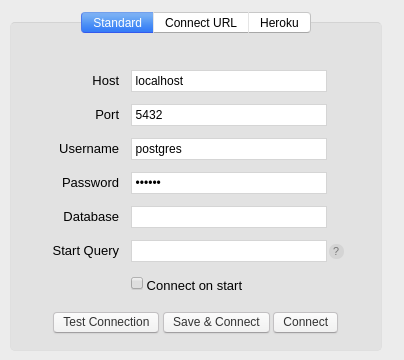

<h1 align="center">GoBarber Backend</h1>

### environment

- Eslint
- Prettier
- EditorConfig
- ES5 import/export syntax (esm)
- Docker
- Postgres
- Sequelize

## How to run

<b> Clone de project to your local repository </b>

```
$ git clone https://github.com/vmnog/gobarber-backend.git

$ cd gobarber-backend

```

<b> Install all dependencies </b>

```
$ yarn install
```

<b>Start / Create your <a href="https://hub.docker.com/_/postgres">Docker Postgres</a> Container:</b>

```
$ docker run --name database -e POSTGRES_PASSWORD=docker -p 5432:5432 -d postgres
```

<b>Check if this container is running:</b>

```
$ docker ps
```

<b>To visualize the postgres database we are going to use <a href="https://www.electronjs.org/apps/postbird">Postbird</a> </b>



<b>Open Postbird and create a new database called `gobarber` </b>

<b>Run all migrations to create all needed tables</b>

```
$ yarn sequelize db:migrate
```
### Continue ...
